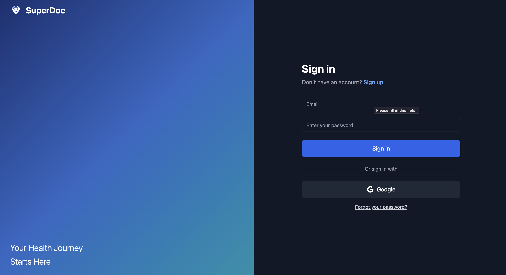
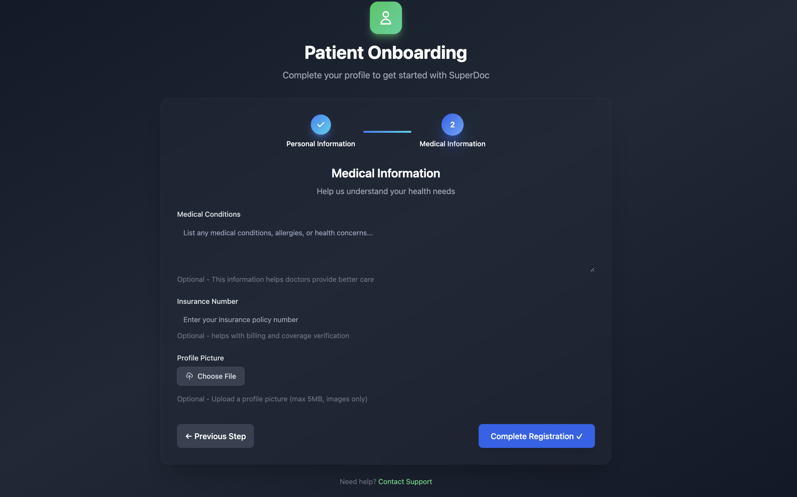
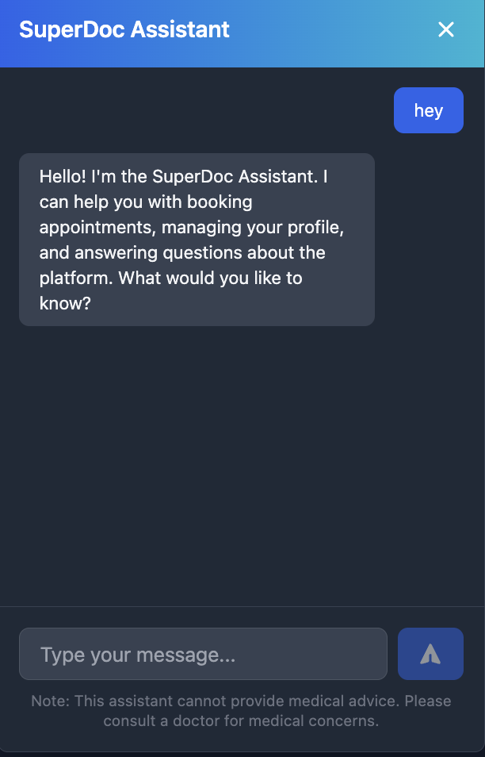

SuperDoc
SuperDoc is a healthcare web application that allows patients to connect with doctors and manage appointments through an online platform.

The system enables patients to check doctor availability, schedule appointments, and access prescriptions written by doctors in a secure and organized way.

Landing Page

  

Patient Onboarding

  

Book Appointment

  

Features
Patient and doctor user roles
Schedule and manage doctor appointments
Check doctor availability before booking
Doctors can write prescriptions for patients
Prescriptions are visible only to the assigned patient
Prescriptions include an expiration date
AI-assisted chatbot prototype that answers health-related questions using keyword-based responses

Technologies Used
Java (Spring Boot)
React
PostgreSQL
Docker

AI Chat

  

What I Learned
Building REST APIs using Spring Boot
Creating interactive frontend interfaces with React
Managing relational databases with PostgreSQL
Implementing role-based access between patients and doctors
